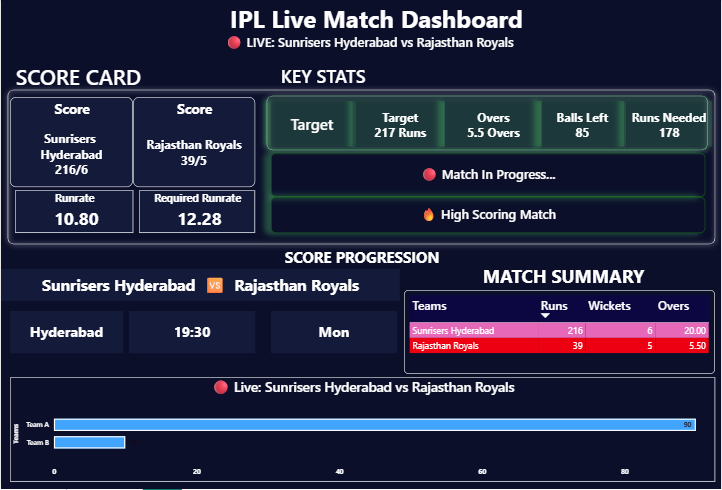

# 🏏 IPL Live Match Dashboard

A real-time IPL dashboard built using Python, SQL Server, and Power BI.

## 🚀 Features

- Live match data using CricAPI
- Real-time data pipeline (Python → SQL)
- Dynamic Power BI dashboard
- Handles Live, Upcoming, and Finished matches
- Win Probability calculation

## 🛠 Tech Stack

- Python
- SQL Server
- Power BI
- DAX

## 📂 Project Structure

- `data_pipeline/` → Python scripts
- `powerbi/` → Dashboard file
- `sql/` → Database schema
- `screenshots/` → Dashboard preview

## ⚙️ Setup

1. Add your CricAPI key in the Python script
2. Run the script to start data collection
3. Connect Power BI to SQL Server

## 📸 Dashboard Preview

## 💡 Learnings

- Real-time data handling
- Data cleaning & filtering
- DAX optimization
- Dashboard design

## 👨‍💻 Author

Faraz Niyazi
